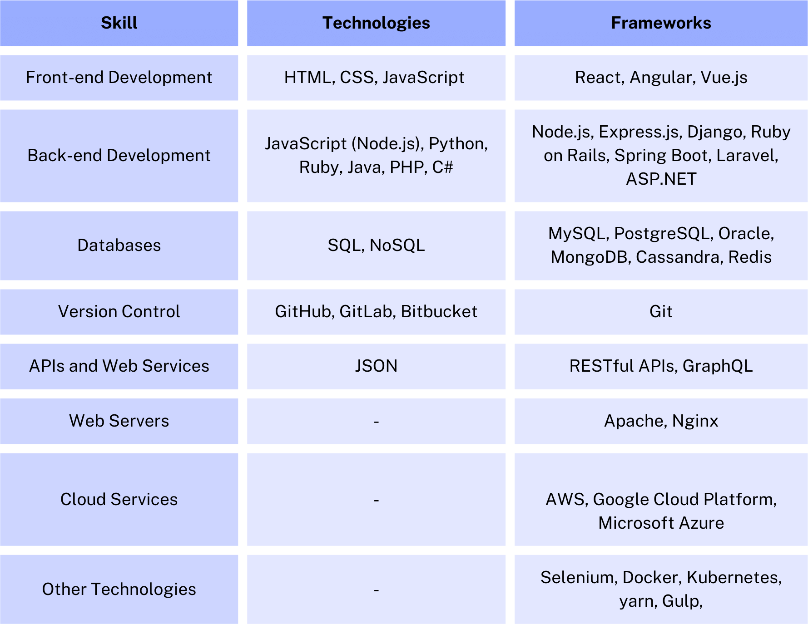

# FSD-C-WE-T-B23

## Full Stack Development

### Day - 1

#### Topics Covered

[x] What is Full Stack Development?  
[x] What is Frontend, Backend & Databases?  
[x] Introduction to web Browser JavaScript V8  
[x] Evolution of HTTP,HTTP Methods  
[x] How the Server looks at the URL  
[x] Request & Response cycle  
[x] Browser js vs Node js

##### What is Full Stack Development?

Full Stack Development is an end-to-end development of a web application.

- end-to-end means from the Frontend to the Backend and the Database [ Components of a web application ]

Type of applications:

- Web Application
- Mobile Application
- Desktop Application
- Hybrid Application
- Enterprise Application
- Embedded Application

##### What is Frontend, Backend & Databases?

- Frontend: The part of the web application that the user interacts with. It is the User Interface(UI) of the web application.

- Backend: This is where the processing of the web application happens.

  - It has the following components:
    - Server: Listens to the incoming requests and sends the response.
    - Application: The logic of the web application + API (Application Programming Interface).
    - Database: The storage of the web application.

- API

  - Application Programming Interface
  - It is a set of rules that allows one software application to talk to another software application.

- Restful API

  - Representational State Transfer
  - It is an architectural style that defines a set of constraints and properties based on HTTP.

- HTTP

  - HyperText Transfer Protocol
  - It is an application layer protocol that is used to transfer data over the web.

- HTTP Methods

  - GET: To get the data from the server.
  - POST: To create the data on the server.
  - PUT: To update the data on the server.
  - PATCH: To partially update the data on the server.
  - DELETE: To delete the data on the server.

- How the Server looks at the URL

  - The server looks at the URL in the following way:
    - Protocol: `http://`
    - Domain: `www.google.com`
    - Port: `:80`

- Request & Response cycle

  - Request: The client sends a request to the server.
  - Response: The server sends a response to the client.

- JavaScript

  - JavaScript is a programming language that is used to make the web pages interactive.
  - Language of the web.

- Browser js vs Node js

  - Browser js: JavaScript that runs in the browser.
  - Node js: JavaScript that runs on the server.

##### Evolution of HTTP

- HTTP/0.9

  - The first version of HTTP.
  - It was a simple protocol that allowed the client to request a file from the server.
  - It was a stateless protocol.

- HTTP/1.0

  - Introduced the concept of headers.
  - It was a stateless protocol.
  - Allowed response codes (eg., 200, 404, 500)

- HTTP/1.1

  - Introduced the concept of persistent connections.
  - It was a stateless protocol.

- HTTP/2

  - Introduced the concept of multiplexing.
  - It was a stateless protocol.

- HTTP/3
  - Introduced the concept of QUIC [ Quick UDP Internet Connections ]
  - It was a stateless protocol.

### Day - 2

#### Topics Covered

[ ] Alerts & Prompts
[x] Variables
[x] Data Types
[x] Operators

Browsers and Javascript Parser Engines:

- Google Chrome: V8
- Firefox: SpiderMonkey
- Safari: JavaScriptCore
- Edge: Chakra

### Day - 3

[x] Conditionals - if, else
[x] Loops - while, do...while, for
[x] Functions

### Day - 4

[x] Hoisting & scope
[x] Arrays & Array Methods
[x] Object and JSON iteration

HTML Tags

Reprsented using ankle brackets (< >)

<!DOCTYPE html>

This is for telling the browser that this is an HTML document and uses HTML5.

<html>

This is the root element of an HTML document. It contains all other elements.

Semantics:

There are special software for the visually impaired people.

<h1> to <h6>

These are the heading tags. <h1> is the largest and <h6> is the smallest.

This is the paragraph tag. It is used to define a paragraph of text.

<strong>
This is the strong tag. It is used to define important text. It is usually displayed in bold.

<em>
This is the em tag. It is used to define emphasized text. It is usually displayed in italics.

<ul>
This is the unordered list tag. It is used to define a list of items. The items are usually displayed with bullet points.

<ol>
This is the ordered list tag. It is used to define a list of items. The items are usually displayed with numbers.

[x] What is HTML & Why to use?
[x] Basic Tags
[x] div Vs span
[x] Semantic Tags
[x] forms
[x] Tables

### Semantic Tags

Semantic tags are the tags that have a meaning. They are used to define the structure of the document.

Background: There are special software for the visually impaired people. They read the document and tell the user what is in the document. They use semantic tags to understand the structure of the document.

- header
- footer
- nav
- article
- aside
- section
- main
- figure
- thead
- tbody
- tfoot

[x] What is css?
[x] Type of CSS - Inline, Internal, External
[x] css selectors ( class vs id vs tag )
[x] display property: inline, block
[x] Intro to pseudo-classes(link,visited,hover,active)

What is CSS?

- Cascading Style Sheets
- It is used to style the HTML document.
- It is used to define the layout of the HTML document.

### Intro to pseudo-classes

Pseudo-classes are used to define the special state of an element.

- :link: It is used to define the state of a link that has not been visited.
- :visited: It is used to define the state of a link that has been visited.
- :hover: It is used to define the state of an element when the mouse is over it.
- :active: It is used to define the state of an element when it is being clicked.

[x] what is box model?
[x] Padding,margin
[x] Vizualize boxmodel in realtime using chrome tools.
[x] CSS Position Properties.
[ ] Colors - solid & linear gradients

### What is Box Model?

The box model is a box that wraps around every HTML element. It consists of:

- Content: The actual content of the box, where text and images appear.
- Padding: Clears an area around the content. It is inside the border.
- Border: A border that goes around the padding and content.
- Margin: Clears an area outside the border. It is like the outermost layer of the box.
- The box model is used to calculate the width and height of an element.

### utf-8 in the meta tag

- It is used to define the character set of the HTML document.
- It is used to define the encoding of the HTML document.

### CSS Position Properties

- static: The default position. The element is positioned according to the normal flow of the document.
- relative: The element is positioned relative to its normal position. We can use top, bottom, left, and right to move the element.
- absolute: The element is positioned relative to its nearest positioned ancestor. We can use top, bottom, left, and right to move the element. It will be removed from the normal flow of the document.
- fixed: The element is positioned relative to the viewport. It will not move when the page is scrolled. It will be removed from the normal flow of the document.
- sticky: The element is positioned based on the user's scroll position. It will switch between relative and fixed, depending on the scroll position.
